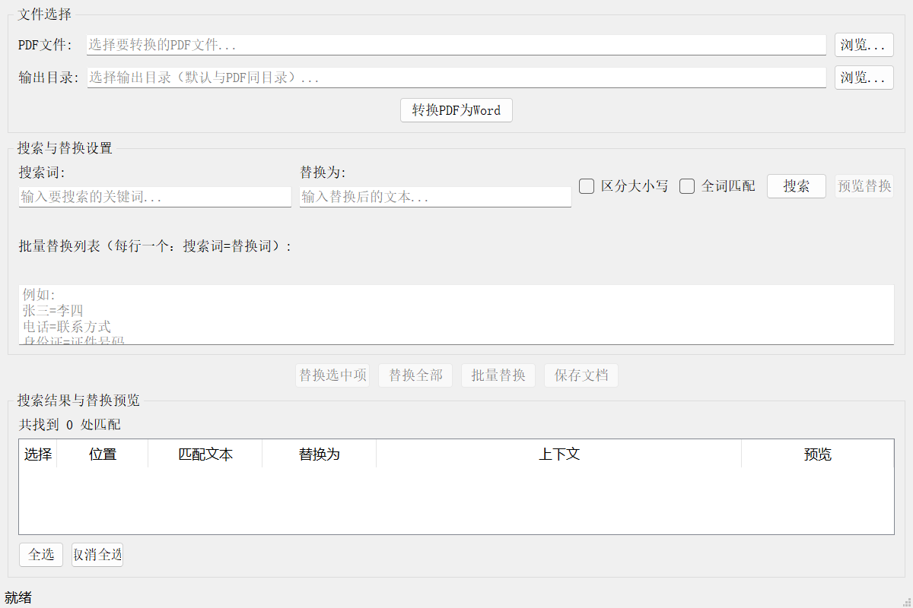

# PDF转Word工具 - 敏感词替换

一款带图形界面的PDF转Word工具，支持敏感词/关键词搜索替换功能。

## 功能特性

- **PDF转Word**: 将PDF文件转换为Word文档(.docx)格式
- **敏感词替换**: 在转换后的文档中搜索并替换指定关键词
- **批量替换**: 支持多组关键词批量替换
- **预览确认**: 替换前可预览效果，支持选择性替换
- **匹配选项**: 支持区分大小写、全词匹配

## 界面预览



## 版本说明

本工具提供三个版本：

| 版本 | 文件名 | 大小 | UI框架 | 说明 |
|------|--------|------|--------|------|
| **CTK版** | `PDF转Word工具_CTK版.exe` | 53MB | CustomTkinter | 现代UI，体积最小 |
| **轻量版** | `PDF转Word工具_轻量版.exe` | 79MB | PyQt5 | 纯文本提取 |
| **完整版** | `PDF转Word工具_完整版.exe` | 120MB | PyQt5 | 保留PDF排版格式 |

### 如何选择？

- **CTK版**: 推荐！体积最小，现代化界面，适合纯文本PDF
- **完整版**: PDF包含表格、图片、复杂排版 → 选择完整版
- **轻量版**: PyQt5界面，纯文本PDF

## 使用方法

### 1. 转换PDF为Word

1. 点击 **浏览...** 按钮选择要转换的PDF文件
2. 选择输出目录（默认与PDF同目录）
3. 点击 **转换PDF为Word** 按钮
4. 等待转换完成

### 2. 搜索关键词

1. 在 **搜索词** 输入框中输入要查找的关键词
2. 可选择匹配选项：
   - **区分大小写**: 精确匹配大小写
   - **全词匹配**: 仅匹配完整单词
3. 点击 **搜索** 按钮
4. 搜索结果将显示在下方表格中

### 3. 替换关键词

**替换单个关键词:**
1. 在 **替换为** 输入框中输入替换后的文本
2. 点击 **预览替换** 查看替换效果
3. 在结果表格中勾选要替换的项
4. 点击 **替换选中项** 或 **替换全部**

**批量替换多个关键词:**
1. 在 **批量替换列表** 中输入规则（每行一个）
   ```
   张三=李四
   电话=联系方式
   身份证=证件号码
   ```
2. 点击 **批量替换**
3. 确认后执行替换

### 4. 保存文档

点击 **保存文档** 按钮，选择保存位置即可。

## 从源码运行

```bash
# 安装依赖
pip install -r requirements.txt

# 运行完整版
python app.py

# 或运行轻量版
python app_lite.py
```

## 打包说明

```bash
# 安装打包工具
pip install pyinstaller

# 打包完整版 (120MB)
pyinstaller --noconfirm --onefile --windowed \
  --name "PDF转Word工具_完整版" \
  --collect-all pdf2docx --collect-all pypdfium2 \
  app.py

# 打包轻量版 (79MB)
pyinstaller --noconfirm --onefile --windowed \
  --name "PDF转Word工具_轻量版" \
  app_lite.py
```

## 系统要求

- 操作系统: Windows 10/11 (64位)
- 无需安装Python环境

## 技术栈

| 版本 | PDF引擎 | 依赖 |
|------|---------|------|
| 完整版 | pdf2docx | OpenCV, NumPy, PyMuPDF |
| 轻量版 | PyMuPDF | PyMuPDF |

## 注意事项

1. PDF转换效果取决于原PDF的复杂程度
2. 建议在替换前先预览确认
3. 替换后请及时保存文档

## 许可证

MIT License